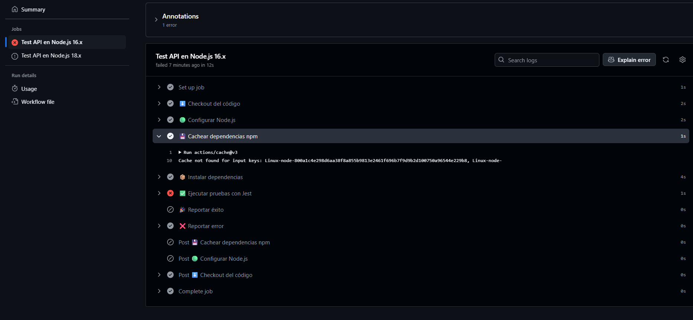
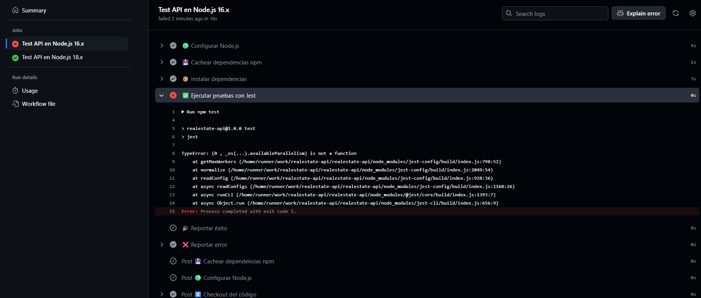

🏡 RealEstate API

Este proyecto corresponde a una API desarrollada en Node.js que gestiona información sobre inmuebles. Durante su desarrollo, se implementaron buenas prácticas de integración continua (CI) utilizando GitHub Actions para automatizar pruebas y garantizar calidad desde el primer push.

🔧 Flujo de trabajo automatizado con GitHub Actions
Se creó un flujo de CI que se ejecuta automáticamente al hacer un push o pull request a la rama main. Este flujo incluye:

Instalación de dependencias con npm ci.

Ejecución de pruebas automatizadas con Jest.

Uso de matriz para probar en paralelo en Node.js 16 y 18.

Reporte de resultados según éxito o falla.

Implementación de caché para acelerar tiempos.

Esto permite validar que la API funcione correctamente en entornos reales antes de subir cambios a producción.

🧪 Pruebas en múltiples entornos de Node.js
Una de las claves del pipeline fue probar la API en dos versiones distintas de Node.js (16.x y 18.x) para asegurar compatibilidad y detectar fallas por diferencias entre entornos.

En la primera ejecución, ambas versiones fallaron debido a que no existía una caché previa de dependencias. Esto es normal en ejecuciones iniciales, ya que GitHub Actions aún no ha almacenado nada en su sistema de caché.

Posteriormente, al repetir la ejecución:

Node.js 16.x falló debido a una función (availableParallelism) no disponible en esa versión.

Node.js 18.x pasó correctamente las pruebas.

✅ Validación de API desde el workflow
Se implementó una prueba básica que valida que el endpoint principal (/api/inmuebles) responda correctamente y devuelva una lista de inmuebles. Esta prueba corre automáticamente en cada ejecución del workflow, garantizando que la API siempre funcione como se espera.

🧠 Preguntas Finales

📌 ¿Qué importancia tiene probar en múltiples entornos de Node.js?

Es fundamental para asegurar que la aplicación se comporte correctamente en diferentes versiones del entorno. Esto reduce riesgos de errores en producción, sobre todo si no controlas la versión exacta de Node.js que se usará en el entorno final.

💡 ¿Por qué es importante validar la salida de una API desde un workflow?

Porque automatiza la revisión del comportamiento funcional del sistema. Permite detectar problemas antes de que el código llegue a producción, manteniendo la calidad y reduciendo tiempos de validación manual.

🚀 ¿Qué pasos podrías agregar si fueras a hacer un despliegue a producción?

Validación de código con herramientas estáticas (linting, análisis de seguridad).

Pruebas de integración y pruebas end-to-end.

Despliegue automático a un entorno de staging.

Aprobación manual o chequeo de calidad antes del despliegue final.

Despliegue automatizado a producción si todo pasa correctamente.

Notificaciones de estado del pipeline (por Slack, correo, etc.).

Rollback automático en caso de fallas.

🛠️ ¿Qué limitaciones tiene GitHub Actions y cómo las enfrentarías?

Tiempo limitado de ejecución en cuentas gratuitas: puede resolverse usando runners auto-hospedados.

No se ejecutan secretos en PRs de forks: se recomienda configurar variables protegidas y revisar manualmente si es necesario.

Dependencia de red o servicios externos: usar mocks o ambientes controlados para pruebas.

Tiempo de espera ocioso por pasos lentos: optimizar dependencias, dividir workflows en jobs más rápidos o paralelos.

🧩 Conclusión

A lo largo del desarrollo de este proyecto, se integraron prácticas reales de DevOps y CI/CD que mejoran significativamente la calidad del código y su preparación para entornos reales. Se automatizó el proceso de testing, se identificaron y resolvieron errores en distintas versiones de Node.js, y se establecieron bases para futuros despliegues continuos.
